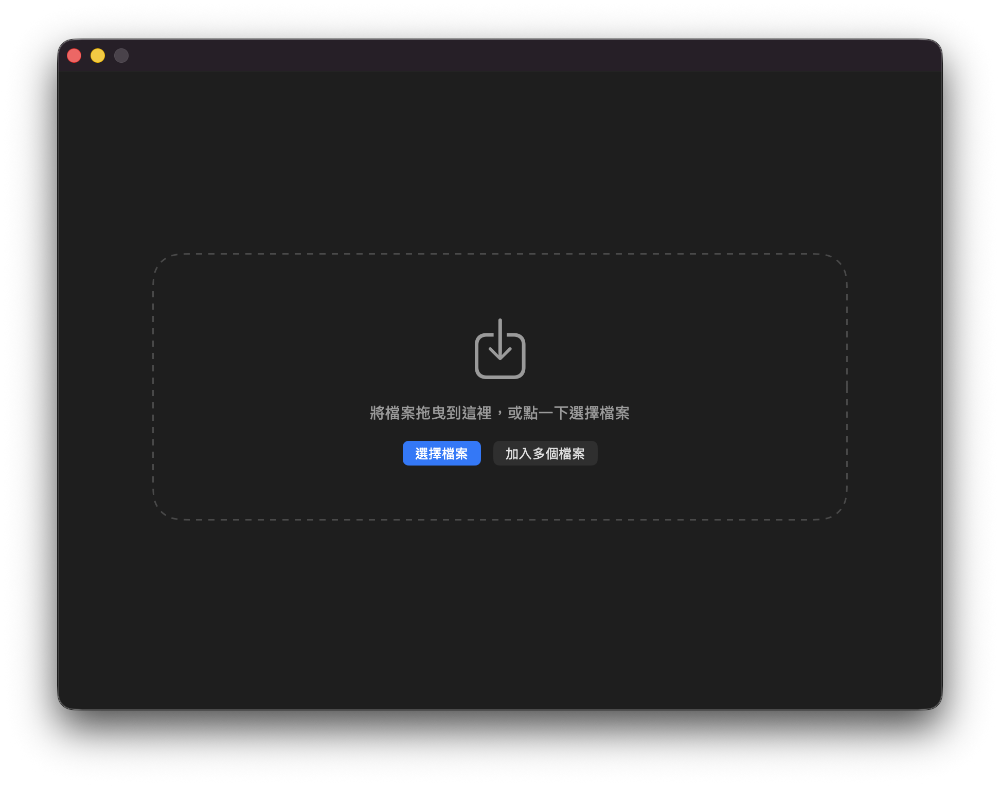
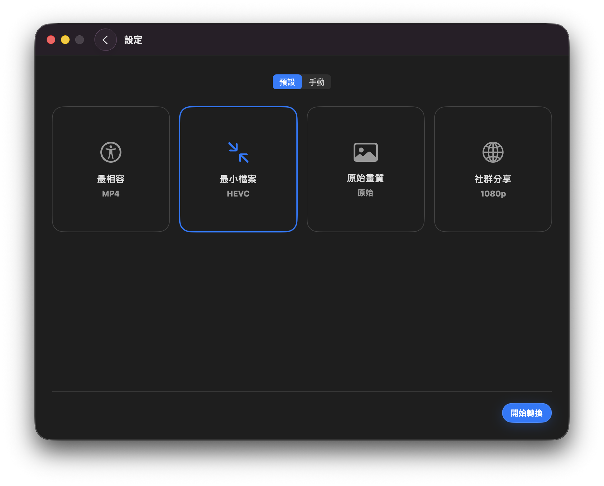

# Convert WF

Convert WF is a simple, narrow-use-cased FFMPEG frontend for converting video file formats. 

## ⚠️ Disclaimer
- This app is a product of cognitive automation. 
- We urge the avoidance of using this app. We are not responsible for any result. We do not promise anything. 
- FFMPEG executable file itself is not included in the source code of this repo.

## Features
Output configurations that are theoretically availiable:
- Container: MP4, MOV, MKV, AVI
- Video codec: Original, H.264, H.265/HEVC
- Audio codec: AAC, Original, MP3
- Resolution: Original, 480p, 1080p, 720p
- Bitrate: video and audio control, presets and customizable

## Requirements
- macOS 15.0+
- English / Traditional Chinese literacy
- Apple silicon (arm64) devices

## Roadmap
This project will freeze at version 1.5 and no further releases is planned. 
We recommend [Dinky](https://github.com/heyderekj/dinky) for similar workflows. We are not in any way affiliated with Dinky or its developer. 

## Contributions
- This repo does not accept contributions.
- Fork it as you like.
- If you notice a significant security vulnerability and wish to report, contact below and I'll choose to fix it or pull the app.

## Support
Contact developer at https://apps.piyan.party/en/support
